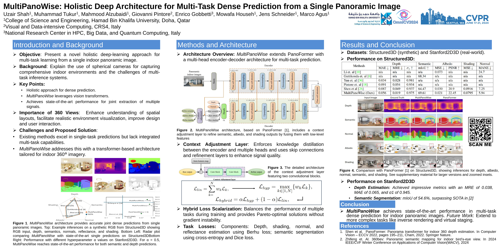

# MultiPanoWise
This is the pytorch implementation of MultiPanoWise (MultiPanoWise: holistic deep architecture for multi-task dense prediction from a single panoramic image, CVPRW 2024)!


[PAPER](https://openaccess.thecvf.com/content/CVPR2024W/OmniCV2024/papers/Shah_MultiPanoWise_Holistic_Deep_Architecture_for_Multi-task_Dense_Prediction_from_a_CVPRW_2024_paper.pdf)
# Methodology


# Poster

 
# PreTrained weights
We updated the models trained for Structured3D in this *[link (click me)](https://drive.google.com/drive/folders/1nmf_QOnCXctaXqQP-fQTAfn_49ca2LXa?usp=sharing)*, now you can download and test it! If you have downloaded it and put it in the correct folder. You can run:


Single-GPU
```bash
python main.py --batch-size 1 --num_epochs 0 --data_path path/to/dataset --load_weights_dir path/to/weights
```
Multi-GPUs
```bash
python -m torch.distributed.launch --nproc_per_node=$nGPUs --use_env main.py --batch-size 1 --num_epochs 0 --data_path path/to/dataset --load_weights_dir path/to/weights
```


# Acknowledgements
We thank the authors of the project below:

[PanoFormer](https://github.com/zhijieshen-bjtu/PanoFormer)

```
@inproceedings{shen2022panoformer,
  title={PanoFormer: Panorama Transformer for Indoor 360$$\^{}$\{$$\backslash$circ$\}$ $$ Depth Estimation},
  author={Shen, Zhijie and Lin, Chunyu and Liao, Kang and Nie, Lang and Zheng, Zishuo and Zhao, Yao},
  booktitle={European Conference on Computer Vision},
  pages={195--211},
  year={2022},
  organization={Springer}
}
```
If you like this work please cite this:
```
@InProceedings{Shah_2024_CVPR,
    author    = {Shah, Uzair and Tukur, Muhammad and Alzubaidi, Mahmood and Pintore, Giovanni and Gobbetti, Enrico and Househ, Mowafa and Schneider, Jens and Agus, Marco},
    title     = {MultiPanoWise: Holistic Deep Architecture for Multi-task Dense Prediction from a Single Panoramic Image},
    booktitle = {Proceedings of the IEEE/CVF Conference on Computer Vision and Pattern Recognition (CVPR) Workshops},
    month     = {June},
    year      = {2024},
    pages     = {1311-1321}
}
```

