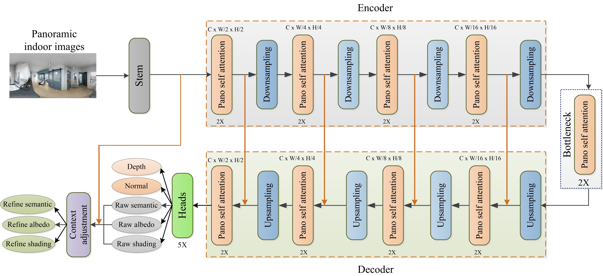
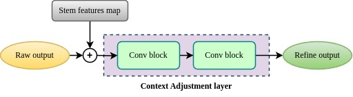

# MultiPanoWise
This is the pytorch implementation of MultiPanoWise (MultiPanoWise: holistic deep architecture for multi-task dense prediction from a single panoramic image, CVPRW 2024)!

# Methodology

# Acknowledgements
We thank the authors of the project below:
[PanoFormer](https://github.com/zhijieshen-bjtu/PanoFormer)

